### Steps to work the simulator 

1. Click on the simulator tab to start the simulation. A short overview of the experiment is provided. Users can read and understand the experiment before beginning the experiment process. After understanding the concepts clearly, click on the “Begin Experiment” button.

  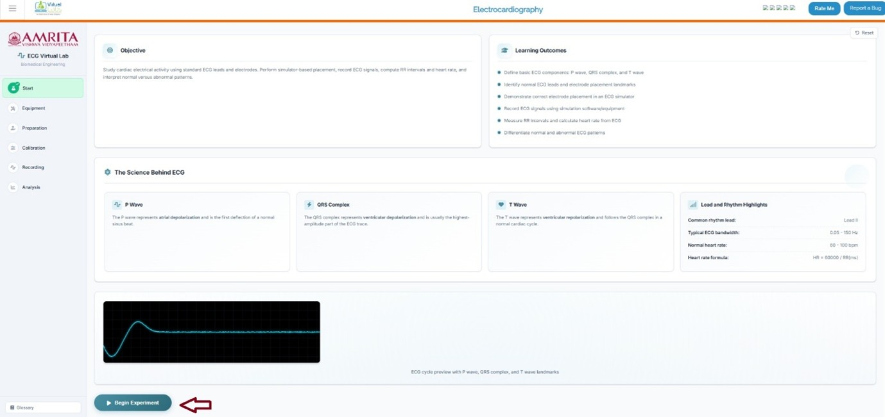

&nbsp;

&nbsp;
 

2. Users can view and perform Equipment Familiarization. Click on each equipment component to get a brief explanation of each equipment.

  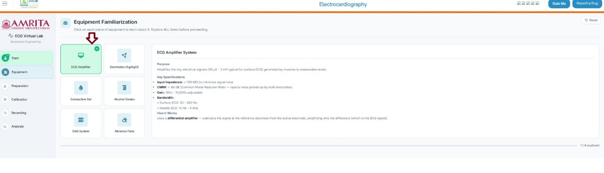

&nbsp;

&nbsp;

3. When completing the six components provided in the simulator window, click on the Continue to preparation button to study ECG recording preparation steps.

  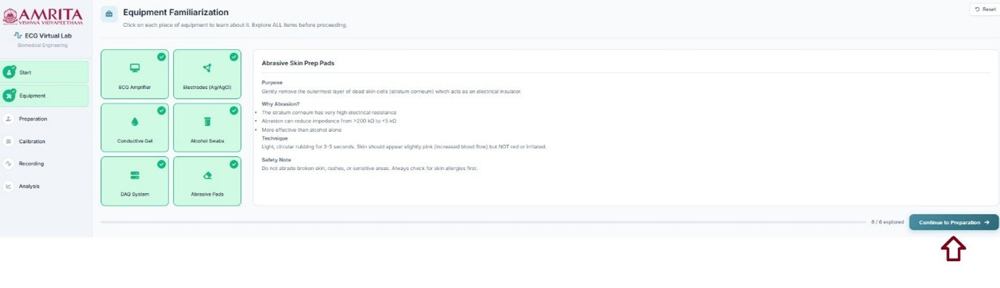

&nbsp;

&nbsp;

4. Users can see the electrode connecting sites for ECG recording. The limb leads need to be attached to the arms and legs (right arm, left arm, and left leg) with the right leg represented as the ground electrode. The chest leads need to be attached to six positions(V1-V6) on the chest, which are specific anatomical positions on the thorax region in a horizontal plane.

  

&nbsp;

&nbsp;

5. The subject preparation and electrode placement method can be visualized at this stage. Here, users must follow a series of steps. First, clean the skin surface with an alcohol swab to remove oil. Drag and drop the clean skin option to the electrode position. Then abrade the skin surface. Click on the Abrade skin surface button. Next is apply gel. Drag and drop the “apply skin gel” to apply gel to each point to reduce the electrode-skin impedance by filling microscopic gaps between the electrode and skin surface. The next step is electrode placement. Click on each electrode site and observe the connection of electrode to its matching target zone. After finishing these steps, click on the " continue to calibration” button to move on to the next step. The impedance value is displayed as a reference between the electrode and the patient’s skin just as an indicator. Low impedance refers to good contact between electrodes and skin

  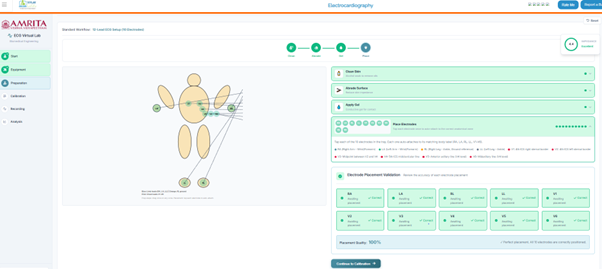

&nbsp;

&nbsp;
 
6. In the calibration step, a basic understanding of the ECG system parameters for optimal signal recording such as gain, high pass filter, low pass filter, and notch filter is provided. Users can adjust the parameters and click on Run calibration to observe ECG signals from the selected site. Users can see the corresponding baseline recordings, Noise, impedance, and SNR values. Then click on Continue recording to move to the next step of the simulator. 

  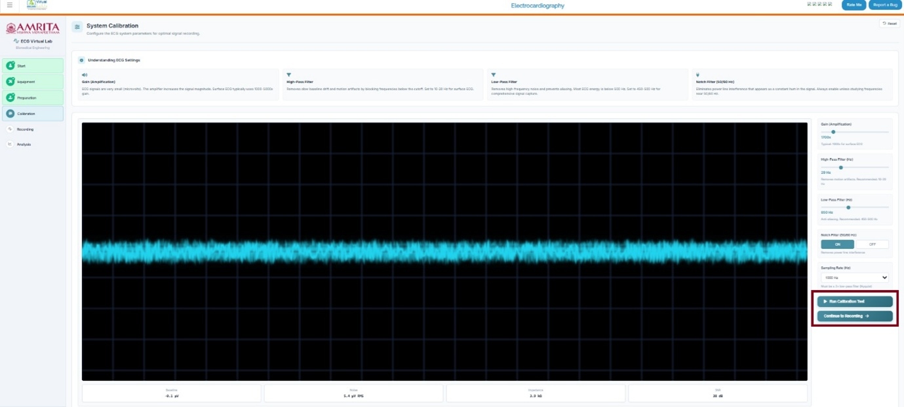

&nbsp;

&nbsp;

7. In the recording phase, the user can change the Rhythm context to normal, mild tachycardia, mild bradycardia and irregular signals to record the signals. Or the users can move the slider to vary rhythm intensity. The user can change the subject condition to normal sinus, tachycardia, bradycardia and irregular rhythm. Users can also change the signal speed.  Here, as an example, a normal sinus is selected. Click on the start recording button to record ECG. 

  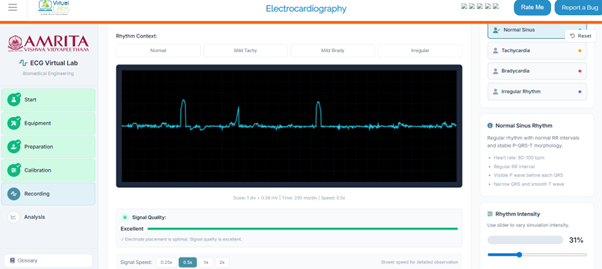

&nbsp;

&nbsp;

8. The ECG signal can be recorded and visualized. The signal properties were provided on the right pane for reference. Click on the stop button to stop recording and then click on save trial to move forward. Users need to repeat this step for the other conditions: tachycardia, bradycardia and irregular rhythm to proceed with the analysis. 

  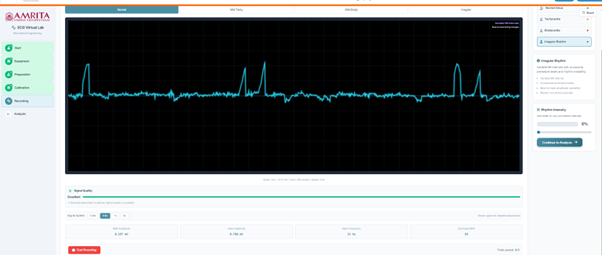

&nbsp;

&nbsp;
 
9. The estimated BPM and the related signal properties were also recorded in the simulator window. Then click on the continue to analysis button to proceed. 

  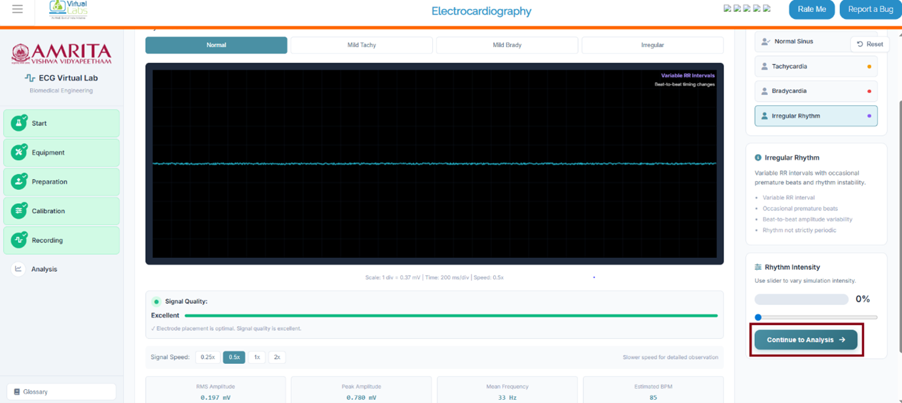

&nbsp;

&nbsp;

10. The result page displays the ECG recorded according to the given input. Users can change the trial and can see the recorded ECG. Time domain, Frequency domain, RMS envelope and comparison of the signal obtained from different subject conditions were displayed. 

  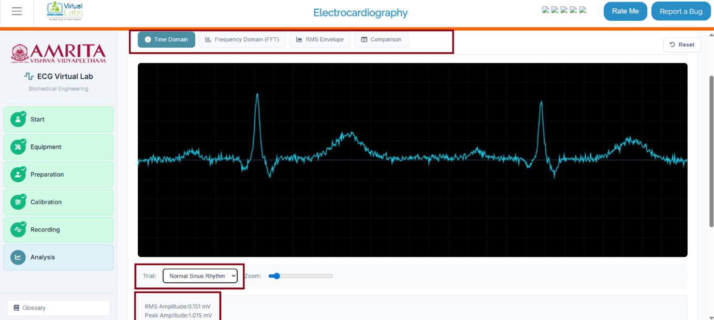

&nbsp;

&nbsp;

11. This shows the comparison of the ECG signals from different subject conditions.

  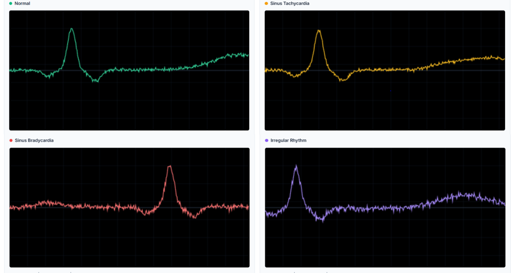

&nbsp;

&nbsp;

12.	Users can download the report of the results and raw data in a CSV file. 

  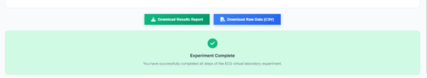

&nbsp;

&nbsp; 

13. The reset button at the top right side of the simulator resets the lab and stops the progress of the experiment. The glossary tab on the bottom left side provides definitions to key terms used in the experiment. 
