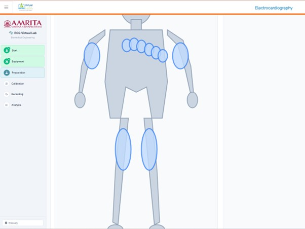
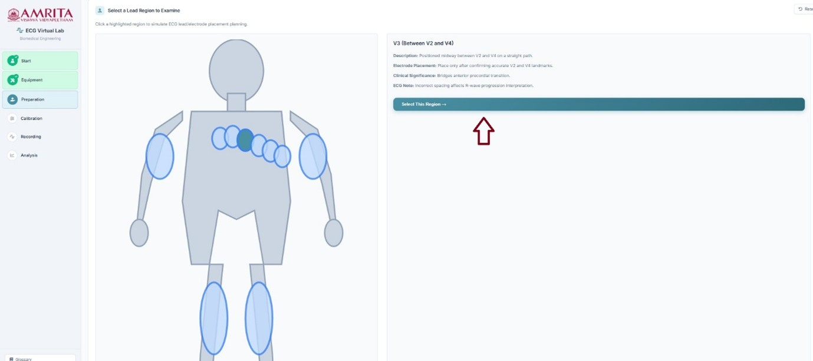
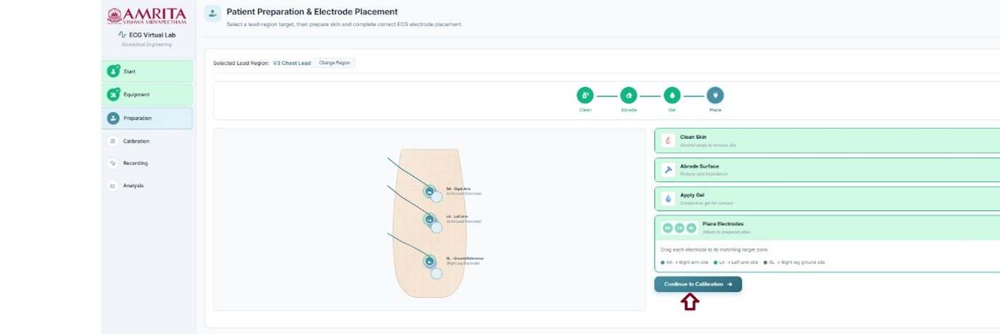
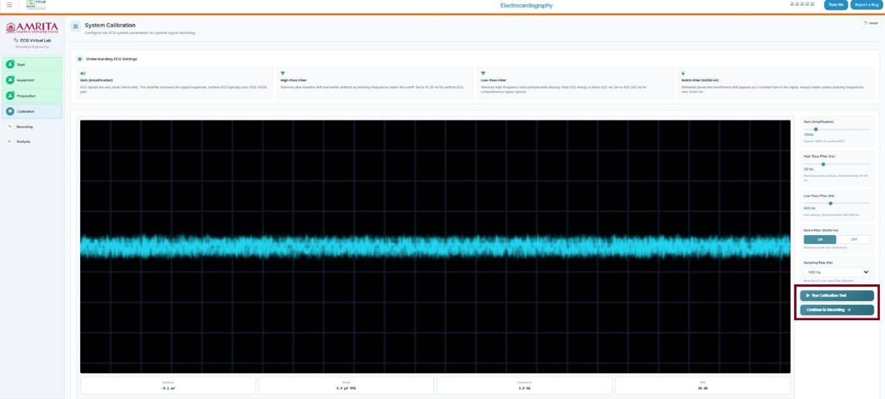

### Steps to work the simulator 

1. Click on the simulator tab to start the simulation. A short overview of the experiment is provided. Users can read and understand the experiment before beginning the experiment process. After understanding the concepts clearly, click on the “Begin Experiment” button.

  

&nbsp;

&nbsp;
 

2. Users can view and perform Equipment Familiarization. Click on each equipment component to get a brief explanation of each equipment.

  

&nbsp;

&nbsp;

3. When completing the six components provided in the simulator window, click on the Continue to preparation button to study ECG recording preparation steps.

  

&nbsp;

&nbsp;

 
4. Users can see the electrode connecting sites for ECG recording. The limb leads need to be attached to the arms and legs (right arm, left arm, and left leg) with the right leg represented as the ground electrode. The chest leads need to be attached to six positions(V1-V6) on the chest, which are specific anatomical positions on the thorax region in a horizontal plane.

  

&nbsp;

&nbsp;
 
5. Users can select any of the highlighted electrode connecting sites to get a brief description of the selected position, clinical significance, electrode placement details, and ECG waveform details for basic understanding. Click on the “select this region” button to study how electrode placement can be done at that specific site.

  

&nbsp;

&nbsp;

6. The subject preparation and electrode placement method can be visualized at this stage. Here, users must follow a series of steps. First, clean the skin surface with an alcohol swab to remove oil. Drag and drop the clean skin option to the electrode position of the skin surface RA site, LA site and RL site . Then abrade the skin surface. Click on the Abrade skin surface button. Next is apply gel. Drag and drop the “apply skin gel” to each point to reduce the electrode-skin impedance by filling microscopic gaps between the electrode and skin surface. The next step is electrode placement. Drag each electrode to its matching target zone. After finishing these steps, click on the " continue to calibration” button to move on to the next step. 

  

&nbsp;

&nbsp;
 
7. In the calibration step, a basic understanding of the ECG system parameters for optimal signal recording such as gain, high pass filter, low pass filter, and notch filter is provided. Users can adjust the parameters and click on Run calibration to observe ECG signals from the selected site. Users can see the corresponding baseline recordings, Noise, impedance, and SNR values. Then click on Continue recording to move to the next step of the simulator. 

  

&nbsp;

&nbsp;

