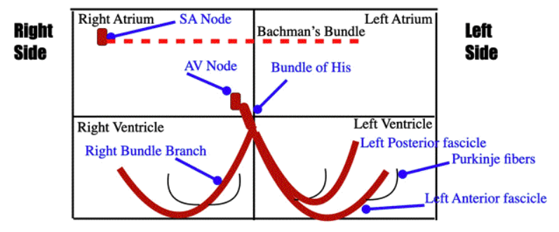
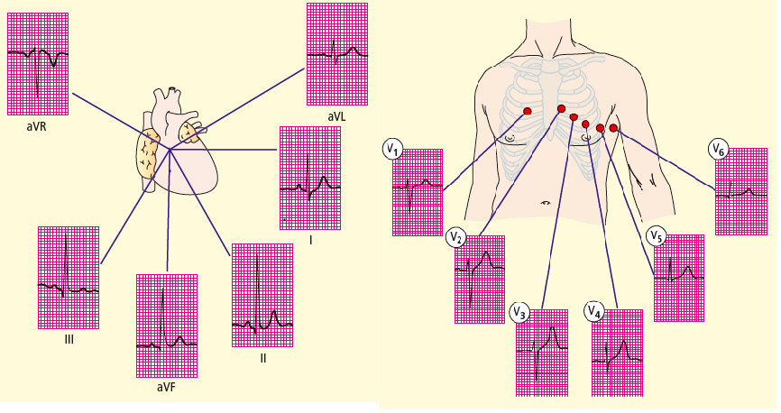
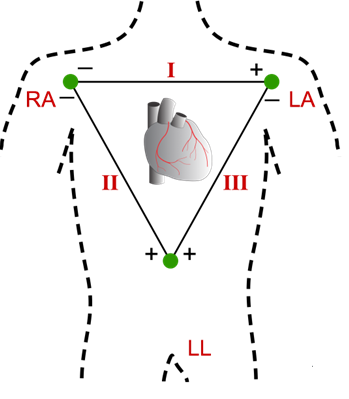
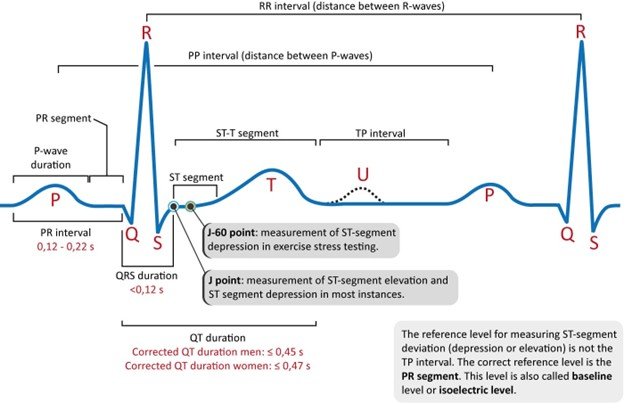

The ECG (electrocardiogram, EKG- Elektrokardiogramm,) is defined as a non-invasive, low-cost technique to monitor the heart based on the detection of its electrical activity.  The action potential (electrical activity) of the heart can be transmitted to the body surface through body fluids, which are good conductors. The sum of the action potential can be recorded by placing electrodes in specific locations of the body with the help of a machine called an electrocardiogram and the process is called electrocardiography.  In 1902, the Dutch physician Einthoven invented ECG, for investigating heart diseases and was named the "father of electrocardiography”. ECG has been recognized as a robust screening and diagnostic tool, and today it is used globally in almost every healthcare setting to assess the severity of cardiovascular diseases. The ECG test are usually employed to diagnose conditions such as irregular heartbeat (arrhythmias), chest pain, post-treatment for a heart attack (myocardial infarction), endocarditis (inflammation or infection of one or more of the heart valves), heart surgery, or cardiac catheterization, and to check the functioning of an implanted pacemaker. Each deflection in the electrogram represents a particular activity in the cardiac cycle and is quite sensitive to minor changes to the structure or function of the heart, which can therefore be considered gold standard diagnostic tool.

&nbsp;

### Cardiac conduction system
The cardiac conduction system included specialized network of cardiac muscle cells and fibers that are responsible for initiating and propagating electrical impulses to coordinate the rhythmic contraction of the heart chambers. The normal electrical activity in the heart occurs in the right atrium where specialized pacemaker cells form the sinoatrial node (SA). The electrical discharges produced by these cells creates depolarization which spreads to the atrial muscle from right to the left and then travels to then travels to Bachmann's Bundle. The Bachmann's bundle is an interatrial conduction pathway responsible for conducting depolarization from the SA node to the left atrium of the heart. The electrical activity reaches the ventricles through atrioventricular node (AVN) which are aslo specialized pacemaker cells. From there, the electrical impulse spreads to His bundle that divides into right and left branches, and the left branch further divides into posterior and anterior fascicles and reaches the Purkinje fibers (Figure 1) and leads to apid ventricular depolarization and ventricular contraction and blood ejection which can be measured using ECG.

&nbsp;

  
   
  <i>Figure 1. Conceptualization of electrical conduction in the heart 
Source: https://www.unm.edu/~lkravitz/EKG/electricalconduction.html
</i>

&nbsp;

### Recording steps in ECG
To record ECG, the subject has to lie down in a relaxed state. The electrical activity directed towards the electrode produces a positive deflection, while the electrical impulse directed away will lead to a negative deflection on the ECG. For recording ECG, a 12-lead system is used which includes limb leads and precordial (chest) leads. The limb leads are attached to the arms and legs, (right arm, left arm, and left leg ) with right leg represented as ground electrode and chest leads are attached to six positions(V1-V6) on the chest, which are specific anatomical positions on the thorax region in a horizontal plane that aid in assessing electrical activity from different regions of the heart. The Standard leads I, II and III (limb leads)  are bipolar leads  that are  oriented in the coronal plane, where two electrodes are active and placed on any two limbs and the potential differene is the algebric sum of the two active electrodes. Leads aVR, aVL and aVF are unipolar leads where one electrode is kept at zero potential, and the other is an active electrode and oriented in the coronal plane (Figure 2).

&nbsp;

  
   
  <i>Figure 2. Electrode placement system representing limb electrodes and chest electrodes 
Source: https://www.unm.edu/~lkravitz/EKG/electricalconduction.html
</i>

&nbsp;

Einthoven’s Triangle represents the formation of an imaginary equilateral triangle with heart at the center surrounded by three bipolar limb electrodes, which is used in the ECG recording process. According to Einthoven's law, the sum of the electrical potential recorded in leads I and III will be equal to the potential measured in lead III (Figure 3).

  
   
  <i>Figure 3. Einthoven’s triangle,  an imaginary triangle formed by limb electrodes (RA, LA, LL) to record the heart’s electrical activity through standard ECG leads (I, II, III).
</i>

&nbsp;

### Components of ECG
ECG components include waves, intervals, and segments, which together form the electrical activity of the heart during a cardiac cycle (Figure 4).

• **P wave**: It represents the electrical activation of the atria, which is initiated by the Sinoatrial node. The atrial muscle fibers contract and pump blood into the ventricles. This is referred to as Atrial depolarization, which is represented by P wave on an ECG.

• **PR segment**: The flat isoelectric portion of the ECG that occurs at the end of the P wave and at the starting phase of the QRS complex. It represents the electrical impulse conduction delay through the AVN node before entering to the ventricles.

•	**PR or PQ segment**: It represents the interval between the start of the P wave and the start of the QRS complex.

•	**QRS complex**: It refers to electrical activation of the ventricles, leading to their contraction known as ventricular depolarization. It has a downward deflection followed by a long upright triangular wave and ends with a downward wave.

•	**J point**: It is the junction between the end of the QRS complex and the start of the ST segment on ECG, representing the end of ventricular depolarization and the beginning of repolarization.

•	**T wave**: It occurs when the ventricles recover after depolarization, restoring the resting state for the next heartbeat preparation. It is a dome-shaped upward deflection.

•	**ST segment**: It represents the isoelectric part of the ECG between the end of the J point and the end of the S wave (QRS complex) and the beginning of the T wave and refers to complete ventricular depolarization before repolarization. 

•	**ST interval**: The time duration representing the end of the QRS complex and the end of T wave. That is the total duration of ventricular repolarization.

•	**QT interval**: The time representing the beginning of the QRS complex and the end of the T wave representing total duration of ventricular depolarization and repolarization.

•	**U wave**: This is a small deflection observed in some individuals after T wave due to slow ventricular repolarization of the intraventricular contracting system.

  
   
  <i>Figure 4. Representation of components of an ECG signal and the duration of each component seen in an electrocardiograph.  Source: https://ecgwaves.com/topic/ecg-normal-p-wave-qrs-complex-st-segment-t-wave-j-point/
</i>

&nbsp;

&nbsp;

### Clinical applications of ECG
The 12-lead ECG gives general information about the size of the chambers and heart orientation by measuring the electrical and muscular functions of the heart. Reading the ECG signal is a helpful approach for clinicians for the comprehensive evaluation of abnormal heart rhythms, heart disease, myocardial infarction and other metabolic conditions. Some of the most common clinical conditions include

1. **Ischemic Heart Diseases**: Myocardial infarction (heart attack): The irreversible death of the heart muscle due to reduced blood flow to the heart. This occurs due to the formation of clots that form plaques in the arteries supplying the heart. Here, in the ECG signal, the ST segment is elevated, and the T wave is inverted. The Q wave may not be prominent in some patients.

2. **Arrhythmias**: This is associated with the rate of the heartbeat, causing tachycardia (heartbeat too fast), bradycardia (too slow) or irregular heartbeat. In the ECG signal, the P-waves are either absent or abnormal, irregular rhythms and altered QRS morphology.

3. **Atrioventricular (AV) block**: The electrical signals travelling from the atria to the ventricles are delayed or blocked, resulting in a slow or irregular heartbeat. Prolonged PR intervals or dropped QRS complexes on ECG are characteristic of AV block.

4. **Pericarditis**: It is inflammation of the pericardium, the sac that contains the heart, due to infectious diseases. A diffuse ST elevation with PR depression is the characteristic of the ECG of such conditions.
